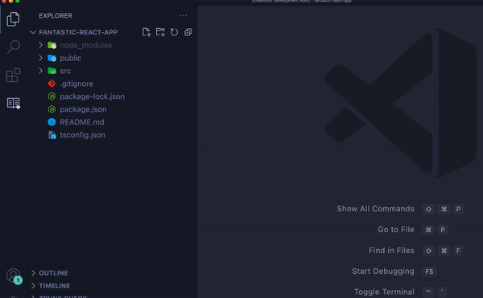

# GistNote README

GistNote allows you to browse your GitHub gists and create new ones.

## Getting Started

1. Install GistNote from VSCode Marketplace
2. Click `GistNote` icon on Activity Bar
3. If prompted, login to your GitHub account
4. When authenticated, your gists appear on Side Bar

## Features

### Browse Existing Gists

You can browse and open both your public and secrete gists. You can do so in either of the following two ways.

- Click `GistNote` icon on Activity Bar
- Execute `GistNote: browse gists` from Command Palette

Either of the above two operations brings up your gists on Side Bar. To inspect the content of a gist file, click the name of the file on Side Bar. This shows the file as a virtual document in Editor. Virtual documents are read-only. You CANNOT edit them.

### Create New Gists

Do you have a code snippet you want to save as a gist file? You can create both public and secrete gists right from VSCode Editor.

1. Open a document on Editor and select a text (code snippet) you want to save as a gist file.
2. Do either of the following

- Right click anywhere on Editor and bring up a context menu. Select `Create a public gist` or `Create secrete gist`.
- Execute `GistNote: Create a pubic gist` or `GistNote: Create a secrete gist` from Command Pallet

3. In Input Box that pops up, optionally give a description to the gist to create.
4. Give a name to the gist file to create.
5. If the gist is successfully created, you see a message appears confirming the creation of the gist.

### Please give me feedbacks!

This is my personal project. If you want to additional functionalities, please let me know!

---

## Release Notes

Users appreciate release notes as you update your extension.

### 1.0.0

Initial release of GistNote

### 1.0.1

Fix a bug with authentication
